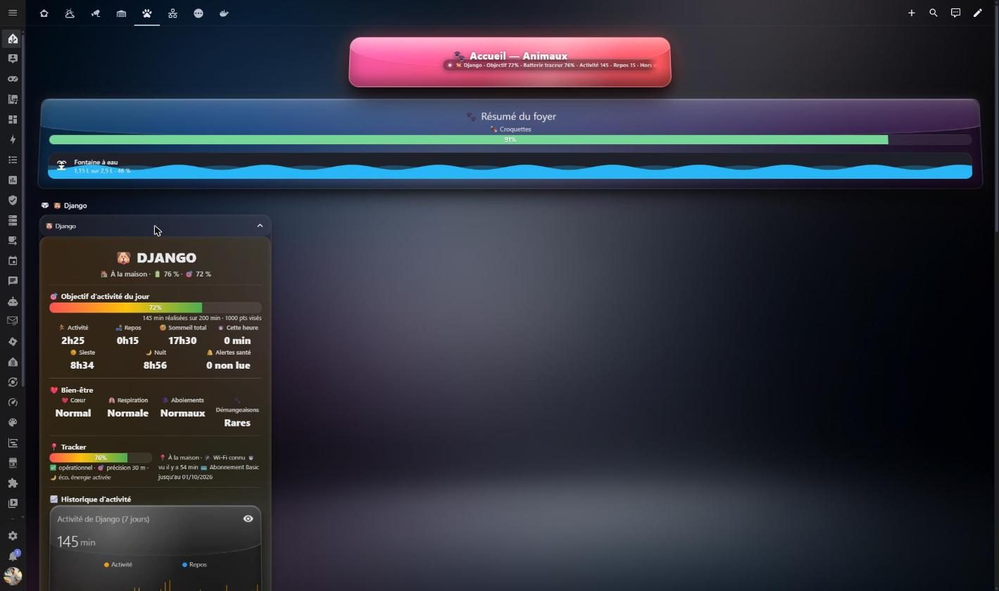

<p align="center">
  
</p>

<h1 align="center">Tractive Plus — intégration Home Assistant</h1>

<p align="center">
  <a href="https://github.com/hacs/integration"></a>
  <a href="LICENSE"></a>
  
</p>

## Pourquoi cette intégration ?

L'intégration officielle **Tractive** de Home Assistant n'expose qu'une petite partie
des données renvoyées par l'API : position, batterie et quelques compteurs d'activité.

**Tractive Plus** vient la compléter : elle réutilise la session déjà ouverte par
l'intégration officielle (aucun identifiant supplémentaire à saisir) et publie une
trentaine d'entités additionnelles pour chaque tracker et chaque animal,
traduites en français et en anglais.

## Fonctionnalités

**Tracker (35 capteurs)** : altitude, précision de la position, source de position
(GPS / LTE / Wi-Fi), horodatage de la dernière position, vitesse, cap, état de la
batterie, raison de l'état courant, statut matériel, dernier rapport matériel, état
du clip, état de température, version du firmware, édition matérielle, mode économie
de batterie, sensibilité des clôtures virtuelles.

**Zones et abonnement** : zone d'économie d'énergie active, type de zone prioritaire,
date d'entrée et dernière détection dans la zone, statut / fin / formule / périodicité
de l'abonnement.

**Santé et activité de l'animal** : fréquence cardiaque au repos, fréquence
respiratoire au repos, aboiements, grattage, alertes santé, progression de l'objectif
d'activité, sommeil total, activité de l'heure en cours, dernière synchronisation,
objectifs quotidiens de distance et de points.

**Capteurs binaires (4)** : présence dans une zone d'économie d'énergie, assurance
active, abonnement reconductible, phase de séparation.

**Service `tractive_plus.probe`** : interroge n'importe quel endpoint de l'API
Tractive et renvoie la réponse JSON, pratique pour explorer de nouvelles données.

## Prérequis

- Home Assistant 2024.12 ou plus récent (2026.3+ pour l'affichage du logo)
- L'intégration officielle **Tractive** installée, configurée et chargée
- Un tracker Tractive avec un abonnement actif

## Installation

### Via HACS (dépôt personnalisé)

1. HACS → menu ⋮ → **Dépôts personnalisés**
2. URL : `https://github.com/Dujonkev/tractive-plus`, catégorie : **Integration**
3. Rechercher **Tractive Plus**, installer, puis redémarrer Home Assistant
4. **Paramètres → Appareils et services → Ajouter une intégration → Tractive Plus**

### Manuellement

Copier le dossier `custom_components/tractive_plus` dans le dossier
`custom_components` de votre configuration, redémarrer Home Assistant, puis ajouter
l'intégration.

## Configuration

Aucune. Le flux de configuration ne demande rien : l'intégration récupère la session
Tractive existante. Les données sont rafraîchies toutes les 2 minutes (les endpoints
lents, santé et abonnement, sont interrogés moins souvent).

## Exemple : service probe

```yaml
action: tractive_plus.probe
data:
  path: pet/<pet_id>/health/overview
  aps: false
```

La réponse JSON est renvoyée dans la variable de réponse de l'action et journalisée
au niveau `info`.

## Exemple de dashboard (Lovelace)

Une carte complete pour visualiser un animal (activite, bien-etre, tracker, historique) peut etre construite avec la carte tierce custom:ultra-card (a installer separement via HACS, voir https://github.com/WJDDesigns/Ultra-Card). Remplacez les identifiants d'entites par les votres avant de l'utiliser.




```yaml
type: custom:ultra-card
_config_version: 2
card_background: linear-gradient(135deg, rgba(255,152,0,0.16), rgba(76,175,80,0.12))
card_border_radius: 18
card_border_color: var(--divider-color)
card_border_width: 1
card_padding: 20
layout:
  rows:
    - id: dj-hero
      columns:
        - id: dj-hero-c
          modules:
            - id: text-1789067496777-0c2op23vd
              type: text
              text: 🐶 VOTRE_ANIMAL
              font_size: 30
              font_weight: '800'
              color: var(--primary-text-color)
              alignment: center
              intro_animation: fadeIn
            - id: text-1789067496777-f19g1aedr
              type: text
              text: Suivi Tractive
              font_size: 15
              font_weight: '500'
              color: var(--secondary-text-color)
              alignment: center
              intro_animation: fadeIn
              unified_template_mode: true
              unified_template: >-
                {{ "🏠 À la maison" if
                is_state("device_tracker.tracker_VOTRE_TRACKER_ID","home") else "🐾 En
                vadrouille" }}  ·  🔋 {{
                states("sensor.tracker_VOTRE_TRACKER_ID_batterie") }} %  ·  🎯 {{
                states("sensor.animaux_VOTRE_ANIMAL_progression_de_l_objectif") }} %
    - id: dj-sep1
      columns:
        - id: dj-sep1c
          modules:
            - id: separator-1789067496777-mqvt1t1p6
              type: separator
              separator_style: line
              thickness: 1
              margin: normal
              width_percent: 100
              color: rgba(255,255,255,0.15)
    - id: dj-goal
      columns:
        - id: dj-goalc
          modules:
            - id: text-1789067496777-6rh22pujw
              type: text
              text: 🎯 Objectif d’activité du jour
              font_size: 16
              font_weight: '700'
              color: var(--primary-text-color)
              alignment: left
              intro_animation: fadeIn
            - id: bar-1789067496777-cu49agty4
              type: bar
              entity: sensor.animaux_VOTRE_ANIMAL_progression_de_l_objectif
              percentage_type: entity
              percentage_entity: sensor.animaux_VOTRE_ANIMAL_progression_de_l_objectif
              percentage_min: 0
              percentage_max: 100
              height: 24
              bar_style: flat
              bar_size: medium
              bar_radius: round
              bar_direction: left-to-right
              bar_width: 100
              show_percentage: true
              show_value: false
              label_alignment: space-between
              use_gradient: true
              gradient_display_mode: full
              gradient_stops:
                - id: '1'
                  position: 0
                  color: '#ff5252'
                - id: '2'
                  position: 50
                  color: '#ffc107'
                - id: '3'
                  position: 100
                  color: '#4caf50'
              bar_color: var(--success-color)
              background_color: rgba(255,255,255,0.08)
              intro_animation: fadeIn
              tap_action:
                action: nothing
              hold_action:
                action: nothing
              double_tap_action:
                action: nothing
            - id: text-1789067496777-099uzm8z8
              type: text
              text: Activité du jour
              font_size: 13
              font_weight: '400'
              color: var(--secondary-text-color)
              alignment: right
              intro_animation: fadeIn
              unified_template_mode: true
              unified_template: >-
                {{ states("sensor.VOTRE_ANIMAL_temps_d_activite") }} min réalisées sur
                {{ states("sensor.VOTRE_ANIMAL_objectif_quotidien") }} min · {{
                states("sensor.animaux_VOTRE_ANIMAL_objectif_de_points_quotidien") }}
                pts visés
    - id: dj-stats1
      columns:
        - id: col-act
          modules:
            - id: text-1789067496777-nik12xnei
              type: text
              text: 🏃 Activité
              font_size: 13
              font_weight: '600'
              color: var(--secondary-text-color)
              alignment: center
              intro_animation: fadeIn
            - id: text-1789067496777-s47w3gz57
              type: text
              text: —
              font_size: 21
              font_weight: '800'
              color: var(--primary-text-color)
              alignment: center
              intro_animation: fadeIn
              unified_template_mode: true
              unified_template: >-
                {{
                v // 60 }}h{{ "%02d"|format(v % 60) }}
        - id: col-rep
          modules:
            - id: text-1789067496777-u2p29a1ox
              type: text
              text: 🛋️ Repos
              font_size: 13
              font_weight: '600'
              color: var(--secondary-text-color)
              alignment: center
              intro_animation: fadeIn
            - id: text-1789067496777-h17ckp4cm
              type: text
              text: —
              font_size: 21
              font_weight: '800'
              color: var(--primary-text-color)
              alignment: center
              intro_animation: fadeIn
              unified_template_mode: true
              unified_template: >-
                {{ v
                // 60 }}h{{ "%02d"|format(v % 60) }}
        - id: col-slp
          modules:
            - id: text-1789067496777-dyj9hocyk
              type: text
              text: 😴 Sommeil total
              font_size: 13
              font_weight: '600'
              color: var(--secondary-text-color)
              alignment: center
              intro_animation: fadeIn
            - id: text-1789067496777-81z5wl80t
              type: text
              text: —
              font_size: 21
              font_weight: '800'
              color: var(--primary-text-color)
              alignment: center
              intro_animation: fadeIn
              unified_template_mode: true
              unified_template: >-
                {{ v // 60 }}h{{ "%02d"|format(v % 60) }}
        - id: col-now
          modules:
            - id: text-1789067496777-fb8w5kw5u
              type: text
              text: ⏱️ Cette heure
              font_size: 13
              font_weight: '600'
              color: var(--secondary-text-color)
              alignment: center
              intro_animation: fadeIn
            - id: text-1789067496777-dybd9gj4q
              type: text
              text: —
              font_size: 21
              font_weight: '800'
              color: var(--primary-text-color)
              alignment: center
              intro_animation: fadeIn
              unified_template_mode: true
              unified_template: >-
                {{ states("sensor.animaux_VOTRE_ANIMAL_activite_de_l_heure_en_cours")
                }} min
      column_layout: 25-25-25-25
      gap: 14
      content_alignment: center
      responsive_column_layouts:
        laptop:
          layout: 25-25-25-25
        tablet:
          layout: 50-50
        mobile:
          layout: 50-50
    - id: dj-stats2
      columns:
        - id: col-sd
          modules:
            - id: text-1789067496777-vacoho8al
              type: text
              text: ☀️ Sieste
              font_size: 13
              font_weight: '600'
              color: var(--secondary-text-color)
              alignment: center
              intro_animation: fadeIn
            - id: text-1789067496777-o6o3p79bp
              type: text
              text: —
              font_size: 21
              font_weight: '800'
              color: var(--primary-text-color)
              alignment: center
              intro_animation: fadeIn
              unified_template_mode: true
              unified_template: >-
                {{ v
                // 60 }}h{{ "%02d"|format(v % 60) }}
        - id: col-sn
          modules:
            - id: text-1789067496777-n2cjf8zyp
              type: text
              text: 🌙 Nuit
              font_size: 13
              font_weight: '600'
              color: var(--secondary-text-color)
              alignment: center
              intro_animation: fadeIn
            - id: text-1789067496777-wsfj9fp6k
              type: text
              text: —
              font_size: 21
              font_weight: '800'
              color: var(--primary-text-color)
              alignment: center
              intro_animation: fadeIn
              unified_template_mode: true
              unified_template: >-
                {{ v
                // 60 }}h{{ "%02d"|format(v % 60) }}
        - id: col-al
          modules:
            - id: text-1789067496777-x8jq2qun0
              type: text
              text: 🔔 Alertes santé
              font_size: 13
              font_weight: '600'
              color: var(--secondary-text-color)
              alignment: center
              intro_animation: fadeIn
            - id: text-1789067496777-yeabj3d76
              type: text
              text: —
              font_size: 21
              font_weight: '800'
              color: var(--primary-text-color)
              alignment: center
              intro_animation: fadeIn
              unified_template_mode: true
              unified_template: >-
                {{ v }} non lue{{ "s" if v > 1 else "" }}
      column_layout: 33-33-33
      gap: 14
      content_alignment: center
      responsive_column_layouts:
        laptop:
          layout: 33-33-33
        tablet:
          layout: 33-33-33
        mobile:
          layout: 1-col
    - id: dj-sep2
      columns:
        - id: dj-sep2c
          modules:
            - id: separator-1789067496777-p646b20ik
              type: separator
              separator_style: line
              thickness: 1
              margin: normal
              width_percent: 100
              color: rgba(255,255,255,0.15)
            - id: text-1789067496777-76wu0roj6
              type: text
              text: ❤️ Bien-être
              font_size: 16
              font_weight: '700'
              color: var(--primary-text-color)
              alignment: left
              intro_animation: fadeIn
    - id: dj-health
      columns:
        - id: col-hc
          modules:
            - id: text-1789067496777-b45xrqv52
              type: text
              text: ❤️ Cœur
              font_size: 13
              font_weight: '600'
              color: var(--secondary-text-color)
              alignment: center
              intro_animation: fadeIn
            - id: text-1789067496777-f8g148ui4
              type: text
              text: —
              font_size: 21
              font_weight: '800'
              color: var(--primary-text-color)
              alignment: center
              intro_animation: fadeIn
              unified_template_mode: true
              unified_template: >-
                {{ "Normal" if
                states("sensor.animaux_VOTRE_ANIMAL_frequence_cardiaque_au_repos") ==
                "NORMAL" else
                states("sensor.animaux_VOTRE_ANIMAL_frequence_cardiaque_au_repos")|title
                }}
        - id: col-hr
          modules:
            - id: text-1789067496777-sq39nzeaw
              type: text
              text: 🫁 Respiration
              font_size: 13
              font_weight: '600'
              color: var(--secondary-text-color)
              alignment: center
              intro_animation: fadeIn
            - id: text-1789067496777-ip5rtkh4z
              type: text
              text: —
              font_size: 21
              font_weight: '800'
              color: var(--primary-text-color)
              alignment: center
              intro_animation: fadeIn
              unified_template_mode: true
              unified_template: >-
                {{ "Normale" if
                states("sensor.animaux_VOTRE_ANIMAL_frequence_respiratoire_au_repos")
                == "NORMAL" else
                states("sensor.animaux_VOTRE_ANIMAL_frequence_respiratoire_au_repos")|title
                }}
        - id: col-hb
          modules:
            - id: text-1789067496777-94010iy3g
              type: text
              text: 🗣️ Aboiements
              font_size: 13
              font_weight: '600'
              color: var(--secondary-text-color)
              alignment: center
              intro_animation: fadeIn
            - id: text-1789067496777-0jbur0dlu
              type: text
              text: —
              font_size: 21
              font_weight: '800'
              color: var(--primary-text-color)
              alignment: center
              intro_animation: fadeIn
              unified_template_mode: true
              unified_template: >-
                {{ "Normaux" if states("sensor.animaux_VOTRE_ANIMAL_aboiements") ==
                "NORMAL" else states("sensor.animaux_VOTRE_ANIMAL_aboiements")|title
                }}
        - id: col-hi
          modules:
            - id: text-1789067496777-xdh5y95xl
              type: text
              text: 🐾 Démangeaisons
              font_size: 13
              font_weight: '600'
              color: var(--secondary-text-color)
              alignment: center
              intro_animation: fadeIn
            - id: text-1789067496777-nf78vgu0k
              type: text
              text: —
              font_size: 21
              font_weight: '800'
              color: var(--primary-text-color)
              alignment: center
              intro_animation: fadeIn
              unified_template_mode: true
              unified_template: >-
                {{
                "Rares" if v == "INFREQUENT" else ("Normales" if v == "NORMAL"
                else v|title) }}
      column_layout: 25-25-25-25
      gap: 14
      content_alignment: center
      responsive_column_layouts:
        laptop:
          layout: 25-25-25-25
        tablet:
          layout: 50-50
        mobile:
          layout: 50-50
    - id: dj-sep3
      columns:
        - id: dj-sep3c
          modules:
            - id: separator-1789067496777-4o9ylyl7l
              type: separator
              separator_style: line
              thickness: 1
              margin: normal
              width_percent: 100
              color: rgba(255,255,255,0.15)
            - id: text-1789067496777-0r2izscoq
              type: text
              text: 📍 Tracker
              font_size: 16
              font_weight: '700'
              color: var(--primary-text-color)
              alignment: left
              intro_animation: fadeIn
    - id: dj-track
      columns:
        - id: dj-trackc1
          modules:
            - id: bar-1789067496777-2esfvnluy
              type: bar
              entity: sensor.tracker_VOTRE_TRACKER_ID_batterie
              percentage_type: entity
              percentage_entity: sensor.tracker_VOTRE_TRACKER_ID_batterie
              percentage_min: 0
              percentage_max: 100
              height: 22
              bar_style: flat
              bar_size: medium
              bar_radius: round
              bar_direction: left-to-right
              bar_width: 100
              show_percentage: true
              show_value: false
              label_alignment: space-between
              use_gradient: true
              gradient_display_mode: full
              gradient_stops:
                - id: '1'
                  position: 0
                  color: '#ff5252'
                - id: '2'
                  position: 40
                  color: '#ffc107'
                - id: '3'
                  position: 100
                  color: '#4caf50'
              bar_color: var(--success-color)
              background_color: rgba(255,255,255,0.08)
              intro_animation: fadeIn
              tap_action:
                action: nothing
              hold_action:
                action: nothing
              double_tap_action:
                action: nothing
            - id: text-1789067496777-26oseb3ty
              type: text
              text: Tracker
              font_size: 13
              font_weight: '400'
              color: var(--secondary-text-color)
              alignment: left
              intro_animation: fadeIn
              unified_template_mode: true
              unified_template: >-
                {{ "⚡ en charge" if
                is_state("binary_sensor.tracker_VOTRE_TRACKER_ID_en_charge","on") else
                ("✅ opérationnel" if
                is_state("sensor.tracker_VOTRE_TRACKER_ID_statut","operational") else
                states("sensor.tracker_VOTRE_TRACKER_ID_statut")) }} · 🎯 précision {{
                states("sensor.animaux_tracker_VOTRE_TRACKER_ID_precision_de_la_position")
                }} m · 🌙 éco. énergie {{ "activée" if
                is_state("binary_sensor.tracker_VOTRE_TRACKER_ID_power_saving","on")
                else "désactivée" }}
        - id: dj-trackc2
          modules:
            - id: text-1789067496777-1edf1n8u6
              type: text
              text: Position
              font_size: 13
              font_weight: '400'
              color: var(--secondary-text-color)
              alignment: left
              intro_animation: fadeIn
              unified_template_mode: true
              unified_template: >-
                📍 {{ "À la maison" if
                is_state("device_tracker.tracker_VOTRE_TRACKER_ID","home") else
                states("device_tracker.tracker_VOTRE_TRACKER_ID")|capitalize }} · 🛰️ {{ "Wi-Fi connu" if s == "KNOWN_WIFI" else ("GPS" if s ==
                "GPS" else s) }}

                ⏱️ vu il y a {{ d }} svu il y a {{ d // 60 }} minvu il y a {{ d // 3600 }}
                h {{ (d % 3600) // 60 }} min

                💳 Abonnement {{
                states("sensor.animaux_tracker_VOTRE_TRACKER_ID_formule_d_abonnement")|capitalize
                }} jusqu’au {{
                as_timestamp(states("sensor.animaux_tracker_VOTRE_TRACKER_ID_fin_d_abonnement"),
                0)|timestamp_custom("%d/%m/%Y") }}
      column_layout: 50-50
      gap: 14
      content_alignment: center
      responsive_column_layouts:
        laptop:
          layout: 50-50
        tablet:
          layout: 50-50
        mobile:
          layout: 1-col
    - id: dj-graph-title
      columns:
        - id: dj-graph-title-c
          modules:
            - id: separator-1789067496777-v2mfmt0gp
              type: separator
              separator_style: line
              thickness: 1
              margin: normal
              width_percent: 100
              color: rgba(255,255,255,0.15)
            - id: text-1789067496777-qrzbgpfsh
              type: text
              text: 📈 Historique d’activité
              font_size: 16
              font_weight: '700'
              color: var(--primary-text-color)
              alignment: left
              intro_animation: fadeIn
    - id: dj-graph
      columns:
        - id: dj-graph-c
          modules:
            - id: external_card-1789067496777-br1dnex3t
              type: external_card
              name: Activité de VOTRE_ANIMAL (7 jours)
              card_type: custom:mini-graph-card
              card_config:
                type: custom:mini-graph-card
                name: Activité de VOTRE_ANIMAL (7 jours)
                entities:
                  - entity: sensor.VOTRE_ANIMAL_temps_d_activite
                    name: Activité
                    color: '#ff9800'
                  - entity: sensor.VOTRE_ANIMAL_temps_de_repos
                    name: Repos
                    color: '#2196f3'
                hours_to_show: 168
                show:
                  graph: bar
                  legend: true
                  fill: fade
                card_mod:
                  style: |
                    
                    ha-card {
                      position: relative;
                      border-radius: 22px;
                      overflow: hidden;
                      background:
                        radial-gradient(circle at 30% 20%, rgba(255,255,255,0.22), rgba(255,255,255,0) 45%),
                        radial-gradient(circle at 75% 85%, rgba(0,0,0,0.35), rgba(0,0,0,0) 60%),
                            linear-gradient({{ tint }}, {{ tint }}),
                            var(--card-background-color);
                      box-shadow:
                        0 14px 28px rgba(0,0,0,0.55),
                        0 4px 10px rgba(0,0,0,0.4),
                        inset 0 2px 2px rgba(255,255,255,0.28),
                        inset 0 -12px 20px rgba(0,0,0,0.5),
                        inset 0 0 0 1px rgba(255,255,255,0.06);
                      border: 1px solid rgba(255,255,255,0.12);
                      transform: perspective(800px) rotateX(2deg);
                      transition: transform 0.35s ease, box-shadow 0.35s ease;
                      animation: gaugeBreathe3d 5s ease-in-out infinite;
                    }
                    ha-card::before {
                      content: "";
                      position: absolute;
                      top: 0; left: 0; right: 0;
                      height: 45%;
                      background: linear-gradient(to bottom, rgba(255,255,255,0.16), rgba(255,255,255,0) 100%);
                      pointer-events: none;
                      border-radius: 22px 22px 50% 50% / 22px 22px 30px 30px;
                    }
                    ha-card:hover {
                      transform: perspective(800px) rotateX(0deg) translateY(-4px) scale(1.02);
                    }
                    @keyframes gaugeBreathe3d {
                      0%, 100% { box-shadow: 0 14px 28px rgba(0,0,0,0.55), 0 4px 10px rgba(0,0,0,0.4), inset 0 2px 2px rgba(255,255,255,0.28), inset 0 -12px 20px rgba(0,0,0,0.5), inset 0 0 0 1px rgba(255,255,255,0.06), 0 0 0 rgba(255,255,255,0); }
                      50% { box-shadow: 0 18px 34px rgba(0,0,0,0.6), 0 6px 14px rgba(0,0,0,0.45), inset 0 2px 2px rgba(255,255,255,0.34), inset 0 -12px 20px rgba(0,0,0,0.5), inset 0 0 0 1px rgba(255,255,255,0.06), 0 0 26px rgba(255,255,255,0.14); }
                    }
    - id: dj-cmd-title
      columns:
        - id: dj-cmd-title-c
          modules:
            - id: separator-1789067496777-i33n7odh2
              type: separator
              separator_style: line
              thickness: 1
              margin: normal
              width_percent: 100
              color: rgba(255,255,255,0.15)
            - id: text-1789067496777-qtgyuf1vb
              type: text
              text: 🎛️ Commandes du tracker
              font_size: 16
              font_weight: '700'
              color: var(--primary-text-color)
              alignment: left
              intro_animation: fadeIn
    - id: dj-cmd
      column_layout: 33-33-33
      gap: 14
      content_alignment: center
      responsive_column_layouts:
        laptop:
          layout: 33-33-33
        tablet:
          layout: 33-33-33
        mobile:
          layout: 1-col
      columns:
        - id: dj-cmd-c0
          modules:
            - id: external_card-1789067496777-ubhkj53f4
              type: external_card
              name: 🔊 Buzzer
              card_type: custom:mushroom-entity-card
              card_config:
                type: custom:mushroom-entity-card
                entity: switch.tracker_VOTRE_TRACKER_ID_buzzer
                name: 🔊 Buzzer
                icon: mdi:volume-high
                layout: vertical
                fill_container: true
                card_mod:
                  style: >
                    

                    ha-card {
                      position: relative;
                      border-radius: 22px;
                      overflow: hidden;
                      background:
                        radial-gradient(circle at 30% 20%, rgba(255,255,255,0.22), rgba(255,255,255,0) 45%),
                        radial-gradient(circle at 75% 85%, rgba(0,0,0,0.35), rgba(0,0,0,0) 60%),
                            linear-gradient({{ tint }}, {{ tint }}),
                            var(--card-background-color);
                      box-shadow:
                        0 14px 28px rgba(0,0,0,0.55),
                        0 4px 10px rgba(0,0,0,0.4),
                        inset 0 2px 2px rgba(255,255,255,0.28),
                        inset 0 -12px 20px rgba(0,0,0,0.5),
                        inset 0 0 0 1px rgba(255,255,255,0.06);
                      border: 1px solid rgba(255,255,255,0.12);
                      transform: perspective(800px) rotateX(2deg);
                      transition: transform 0.35s ease, box-shadow 0.35s ease;
                      animation: gaugeBreathe3d 5s ease-in-out infinite;
                    }

                    ha-card::before {
                      content: "";
                      position: absolute;
                      top: 0; left: 0; right: 0;
                      height: 45%;
                      background: linear-gradient(to bottom, rgba(255,255,255,0.16), rgba(255,255,255,0) 100%);
                      pointer-events: none;
                      border-radius: 22px 22px 50% 50% / 22px 22px 30px 30px;
                    }

                    ha-card:hover {
                      transform: perspective(800px) rotateX(0deg) translateY(-4px) scale(1.02);
                    }

                    @keyframes gaugeBreathe3d {
                      0%, 100% { box-shadow: 0 14px 28px rgba(0,0,0,0.55), 0 4px 10px rgba(0,0,0,0.4), inset 0 2px 2px rgba(255,255,255,0.28), inset 0 -12px 20px rgba(0,0,0,0.5), inset 0 0 0 1px rgba(255,255,255,0.06), 0 0 0 rgba(255,255,255,0); }
                      50% { box-shadow: 0 18px 34px rgba(0,0,0,0.6), 0 6px 14px rgba(0,0,0,0.45), inset 0 2px 2px rgba(255,255,255,0.34), inset 0 -12px 20px rgba(0,0,0,0.5), inset 0 0 0 1px rgba(255,255,255,0.06), 0 0 26px rgba(255,255,255,0.14); }
                    }
                icon_color: white
        - id: dj-cmd-c1
          modules:
            - id: external_card-1789067496777-19p3vegvg
              type: external_card
              name: 💡 LED
              card_type: custom:mushroom-entity-card
              card_config:
                type: custom:mushroom-entity-card
                entity: switch.tracker_VOTRE_TRACKER_ID_led
                name: 💡 LED
                icon: mdi:led-on
                layout: vertical
                fill_container: true
                card_mod:
                  style: >
                    

                    ha-card {
                      position: relative;
                      border-radius: 22px;
                      overflow: hidden;
                      background:
                        radial-gradient(circle at 30% 20%, rgba(255,255,255,0.22), rgba(255,255,255,0) 45%),
                        radial-gradient(circle at 75% 85%, rgba(0,0,0,0.35), rgba(0,0,0,0) 60%),
                            linear-gradient({{ tint }}, {{ tint }}),
                            var(--card-background-color);
                      box-shadow:
                        0 14px 28px rgba(0,0,0,0.55),
                        0 4px 10px rgba(0,0,0,0.4),
                        inset 0 2px 2px rgba(255,255,255,0.28),
                        inset 0 -12px 20px rgba(0,0,0,0.5),
                        inset 0 0 0 1px rgba(255,255,255,0.06);
                      border: 1px solid rgba(255,255,255,0.12);
                      transform: perspective(800px) rotateX(2deg);
                      transition: transform 0.35s ease, box-shadow 0.35s ease;
                      animation: gaugeBreathe3d 5s ease-in-out infinite;
                    }

                    ha-card::before {
                      content: "";
                      position: absolute;
                      top: 0; left: 0; right: 0;
                      height: 45%;
                      background: linear-gradient(to bottom, rgba(255,255,255,0.16), rgba(255,255,255,0) 100%);
                      pointer-events: none;
                      border-radius: 22px 22px 50% 50% / 22px 22px 30px 30px;
                    }

                    ha-card:hover {
                      transform: perspective(800px) rotateX(0deg) translateY(-4px) scale(1.02);
                    }

                    @keyframes gaugeBreathe3d {
                      0%, 100% { box-shadow: 0 14px 28px rgba(0,0,0,0.55), 0 4px 10px rgba(0,0,0,0.4), inset 0 2px 2px rgba(255,255,255,0.28), inset 0 -12px 20px rgba(0,0,0,0.5), inset 0 0 0 1px rgba(255,255,255,0.06), 0 0 0 rgba(255,255,255,0); }
                      50% { box-shadow: 0 18px 34px rgba(0,0,0,0.6), 0 6px 14px rgba(0,0,0,0.45), inset 0 2px 2px rgba(255,255,255,0.34), inset 0 -12px 20px rgba(0,0,0,0.5), inset 0 0 0 1px rgba(255,255,255,0.06), 0 0 26px rgba(255,255,255,0.14); }
                    }
                icon_color: white
        - id: dj-cmd-c2
          modules:
            - id: external_card-1789067496777-vu5v6bepo
              type: external_card
              name: 📍 Suivi en direct
              card_type: custom:mushroom-entity-card
              card_config:
                type: custom:mushroom-entity-card
                entity: switch.tracker_VOTRE_TRACKER_ID_suivi_en_direct
                name: 📍 Suivi en direct
                icon: mdi:crosshairs-gps
                layout: vertical
                fill_container: true
                card_mod:
                  style: >
                    

                    ha-card {
                      position: relative;
                      border-radius: 22px;
                      overflow: hidden;
                      background:
                        radial-gradient(circle at 30% 20%, rgba(255,255,255,0.22), rgba(255,255,255,0) 45%),
                        radial-gradient(circle at 75% 85%, rgba(0,0,0,0.35), rgba(0,0,0,0) 60%),
                            linear-gradient({{ tint }}, {{ tint }}),
                            var(--card-background-color);
                      box-shadow:
                        0 14px 28px rgba(0,0,0,0.55),
                        0 4px 10px rgba(0,0,0,0.4),
                        inset 0 2px 2px rgba(255,255,255,0.28),
                        inset 0 -12px 20px rgba(0,0,0,0.5),
                        inset 0 0 0 1px rgba(255,255,255,0.06);
                      border: 1px solid rgba(255,255,255,0.12);
                      transform: perspective(800px) rotateX(2deg);
                      transition: transform 0.35s ease, box-shadow 0.35s ease;
                      animation: gaugeBreathe3d 5s ease-in-out infinite;
                    }

                    ha-card::before {
                      content: "";
                      position: absolute;
                      top: 0; left: 0; right: 0;
                      height: 45%;
                      background: linear-gradient(to bottom, rgba(255,255,255,0.16), rgba(255,255,255,0) 100%);
                      pointer-events: none;
                      border-radius: 22px 22px 50% 50% / 22px 22px 30px 30px;
                    }

                    ha-card:hover {
                      transform: perspective(800px) rotateX(0deg) translateY(-4px) scale(1.02);
                    }

                    @keyframes gaugeBreathe3d {
                      0%, 100% { box-shadow: 0 14px 28px rgba(0,0,0,0.55), 0 4px 10px rgba(0,0,0,0.4), inset 0 2px 2px rgba(255,255,255,0.28), inset 0 -12px 20px rgba(0,0,0,0.5), inset 0 0 0 1px rgba(255,255,255,0.06), 0 0 0 rgba(255,255,255,0); }
                      50% { box-shadow: 0 18px 34px rgba(0,0,0,0.6), 0 6px 14px rgba(0,0,0,0.45), inset 0 2px 2px rgba(255,255,255,0.34), inset 0 -12px 20px rgba(0,0,0,0.5), inset 0 0 0 1px rgba(255,255,255,0.06), 0 0 26px rgba(255,255,255,0.14); }
                    }
                icon_color: white
      display_mode: every
      display_conditions:
        - id: cond_1786838073282_4deod
          type: entity_state
          ui_expanded: true
          entity: switch.tracker_VOTRE_TRACKER_ID_led
          operator: '='
          value: disponible
          attribute: ''
    - id: dj-map
      columns:
        - id: dj-mapc
          modules:
            - id: external_card-1789067496777-qgobcte0l
              type: external_card
              name: Carte
              card_type: map
              card_config:
                type: map
                entities:
                  - person.VOTRE_ANIMAL
                hours_to_show: 12
                aspect_ratio: '16:9'
                theme_mode: auto
    - id: dj-btn
      columns:
        - id: dj-btnc1
          modules:
            - id: button-1789067496777-u14onjifi
              type: button
              label: Carte complète
              style: glass
              show_icon: true
              icon: mdi:map-search
              icon_position: before
              tap_action:
                action: navigate
                navigation_path: /map
              hold_action:
                action: nothing
              double_tap_action:
                action: nothing
        - id: dj-btnc2
          modules:
            - id: button-1789067496777-483wqlf6r
              type: button
              label: Détails tracker
              style: glass
              show_icon: true
              icon: mdi:dog
              icon_position: before
              tap_action:
                action: more-info
                entity: device_tracker.tracker_VOTRE_TRACKER_ID
              hold_action:
                action: nothing
              double_tap_action:
                action: nothing
      column_layout: 50-50
      gap: 14
      content_alignment: center
      responsive_column_layouts:
        laptop:
          layout: 50-50
        tablet:
          layout: 50-50
        mobile:
          layout: 50-50
card_mod:
  style: |
    ha-card {
      position: relative;
      border-radius: 22px;
      overflow: hidden;
      background:
        radial-gradient(circle at 25% 15%, rgba(255,255,255,0.20), rgba(255,255,255,0) 45%),
        radial-gradient(circle at 80% 90%, rgba(0,0,0,0.35), rgba(0,0,0,0) 60%),
        linear-gradient(135deg, rgba(255,152,0,0.14), rgba(76,175,80,0.12)),
        var(--card-background-color);
      box-shadow:
        0 14px 28px rgba(0,0,0,0.45),
        0 4px 10px rgba(0,0,0,0.35),
        inset 0 2px 2px rgba(255,255,255,0.25),
        inset 0 -12px 20px rgba(0,0,0,0.35),
        inset 0 0 0 1px rgba(255,255,255,0.06);
      border: 1px solid rgba(255,255,255,0.12);
    }
```

## Dépannage

- **L'intégration ne se charge pas** : vérifiez que l'intégration officielle Tractive
  est bien chargée, Tractive Plus en dépend.
- **Des capteurs sont indisponibles** : tous les champs ne sont pas renvoyés par tous
  les modèles de tracker ni tous les abonnements.
- **Journaux détaillés** :

```yaml
logger:
  default: warning
  logs:
    custom_components.tractive_plus: debug
```

## Contribuer

Les issues et les pull requests sont bienvenues. Les entités reposent sur des
`translation_key` et leurs libellés vivent dans
`custom_components/tractive_plus/translations/` : ajouter une langue revient à
déposer un fichier `<code_langue>.json` sur le modèle de `fr.json`.

## Avertissement

Projet personnel, non affilié à Tractive GmbH ni à Home Assistant. « Tractive » est
une marque de son propriétaire respectif ; ce dépôt utilise l'API non documentée du
service, qui peut évoluer sans préavis.

Sous licence MIT.
